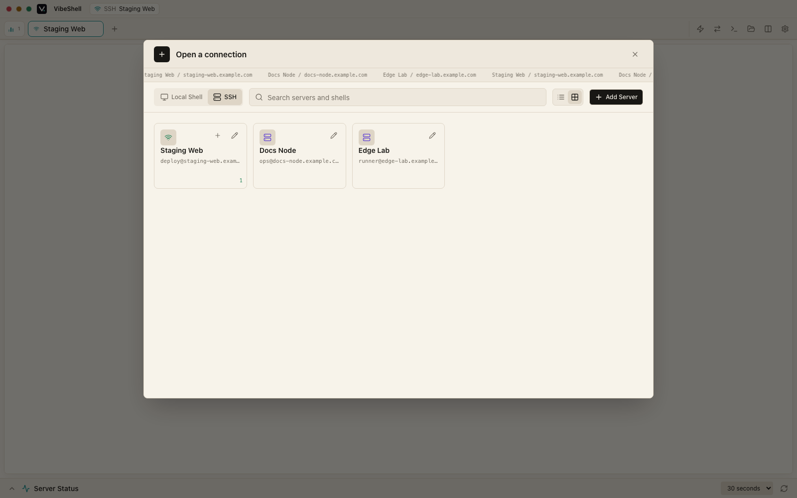
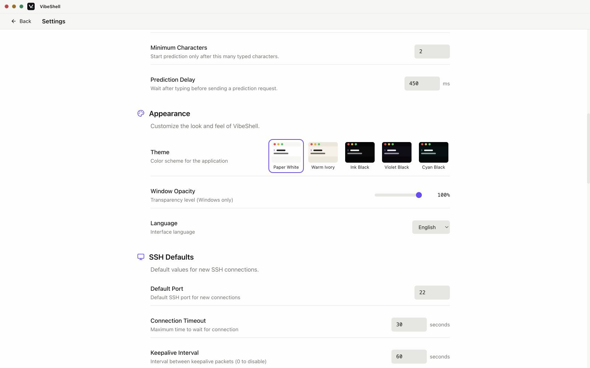

<div align="center">


# VibeShell

**The local-first SSH workspace for developers, operators, and coding agents.**

Desktop command center · Native headless CLI · Persistent Rust sessions · Bundled Agent Skill

[](https://github.com/veithly/vibeshell/releases)
[](https://github.com/veithly/vibeshell/actions/workflows/ci.yml)
[](https://v2.tauri.app)
[](https://react.dev)
[](https://www.rust-lang.org)
[](#install)

[Why VibeShell](#why-vibeshell) · [Screenshots](#screenshots) · [Quick Start](#quick-start) · [Features](#features) · [Native CLI](#native-cli) · [AI Agents](#ai-agents) · [Security](#security-and-current-boundaries) · [Install](#install) · [Build](#build-from-source)

</div>


VibeShell brings SSH, SFTP, tunnels, local shells, remote files, and coding agents into one observable workspace. Its desktop app, standalone `vibeshell` command, bundled Coding Agent Skill, and optional MCP Gateway all use the same local server inventory and persistent session model.

The desktop window is not the control plane. Close it and the native Rust daemon can keep serving the CLI and compatible coding agents on a workstation or a server without a graphical desktop. Open the app again and it can discover sessions created from the command line instead of forcing you to start over.

VibeShell is designed for a workflow that traditional SSH clients rarely treat as a first-class use case: a human and an AI agent operating the same infrastructure while preserving named targets, session continuity, visible output, file context, and explicit safety boundaries.

> The screenshots in this README are rendered with Playwright from VibeShell's real React components using sanitized demo servers. They use reserved example domains only; no real hostnames, IPs, credentials, or customer data are shown.

## Why VibeShell

### One control plane, three ways to work

| Interface | Best for | What it shares |
| --- | --- | --- |
| **Desktop workspace** | Interactive terminal work, split panes, SFTP, tunnels, recordings, approvals, and visual inspection | Servers, groups, credentials/key references, sessions, snippets, fingerprints, and local settings |
| **Native `vibeshell` CLI** | Headless servers, scripts, CI helpers, remote commands, file operations, and terminal-native SFTP | The same server database and reusable native session daemon |
| **Coding Agent integrations** | Claude Code, Codex, Cursor, OpenCode, Gemini CLI, Windsurf, Roo Code, Continue, Kiro, Trae, OpenHands, and other detected tools | A bundled Skill that calls the native CLI directly, plus an optional authenticated GUI-shared Gateway |

### What makes it different

VibeShell does not try to replace the SSH protocol. It improves the operating model around it.

| Workflow need | Raw `ssh` / `sftp` workflow | Typical desktop SSH workflow | VibeShell |
| --- | --- | --- | --- |
| **Session continuity** | Usually tied to one terminal or an external multiplexer | Often confined to tabs inside the running app | Persistent sessions can be reused, listed, attached, executed against, and addressed by short aliases from the desktop, CLI, or Agent Skill |
| **Headless operation** | Native, but separate from GUI inventory and file tooling | Usually requires the desktop process | The same Rust service works with or without the desktop; no Node.js, Electron, or browser process is required |
| **AI agent access** | Agents reconstruct raw shell commands and connection arguments | Integration is often product- or plugin-specific | A canonical Skill ships with VibeShell, installs into detected agent directories, and uses saved server names instead of exposing credentials |
| **Migration** | Existing OpenSSH config works, but other client profiles remain separate | Connections are commonly re-entered by hand | Safe preview and import from OpenSSH, PuTTY, and Tabby, with duplicate detection, conflict renaming, key-path preservation, and jump-host linking |
| **Remote files** | Separate `scp`, `rsync`, editors, and ad-hoc temporary files | Usually a client-specific file browser | Finder-style SFTP, shared file tabs, guarded text editing, media previews, searchable archives, direct CLI file primitives, and recursive sync |
| **Observable automation** | Output exists, but context and intent are fragmented across shells | Visual state is available only while the app is open | Session output, aliases, exit status, live Git diffs, Agent activity, and optional approval gates can be kept in one workspace |
| **Data ownership** | Local by default | Varies by product and account model | Local-first SQLite storage with no hosted VibeShell control plane; optional encrypted sync uses your private GitHub Gist or WebDAV endpoint |

Most SSH tools specialize in one layer: a terminal, a file manager, a connection database, or an automation API. VibeShell is useful when those layers need to stay connected across human and agent work.

## Screenshots

| Server launcher | Split terminal workspace |
| --- | --- |
|  |  |

| Finder-style SFTP | Tunnel manager |
| --- | --- |
|  |  |

| AI integrations | Theme system |
| --- | --- |
|  |  |

## Quick Start

### Use the desktop app

1. Download the installer for your platform from [GitHub Releases](https://github.com/veithly/vibeshell/releases).
2. Start VibeShell. It opens directly into a local shell instead of an empty landing page.
3. Add a server manually or import existing profiles.
4. Open SSH, SFTP, tunnels, files, snippets, or a local coding agent from the same workspace.

### Import existing SSH profiles

Preview first:

```bash
vibeshell import auto --dry-run
```

Use structured output when reviewing a large migration:

```bash
vibeshell import auto --dry-run --json
```

Import the discovered OpenSSH, PuTTY, and Tabby profiles:

```bash
vibeshell import auto
vibeshell servers
```

Third-party passwords are deliberately not copied. Imported OpenSSH private keys remain referenced by local path and are read only when VibeShell establishes a connection.

### Run without a desktop

Install a headless release archive, then use the same native command on macOS, Linux, or Windows:

```bash
vibeshell version
vibeshell servers
vibeshell ssh prod-web -- uname -a
vibeshell sessions
vibeshell sftp prod-web ls /var/www
```

Commands that need a connection automatically start the local daemon when no desktop process is running.

### Reuse a session instead of reconnecting

```bash
vibeshell ssh prod-web
vibeshell sessions
vibeshell ssh-session 001 -- systemctl status nginx
vibeshell get-content --session 001 /var/log/nginx/error.log --max-bytes 200000
vibeshell attach 001
```

By default, `vibeshell ssh <server>` reuses the earliest active session for that server. Use `--new` only when an independent parallel shell is intentional.

## Features

### Terminal and session continuity

- Multi-tab SSH sessions, local shells, and embedded coding-agent sessions.
- Direct-to-terminal startup with a real interactive login shell.
- Up to four panes with horizontal and vertical split layouts.
- Persistent native sessions shared through the local daemon rather than tied to one UI tab.
- Short session aliases such as `001` for attach, command execution, file access, SFTP, keystrokes, and termination.
- Session reuse by default, with explicit `--new` behavior for parallel connections.
- CLI-created SSH sessions can be discovered by the desktop workspace.
- xterm.js rendering with WebGL acceleration, web links, responsive fitting, and low-latency batched input.
- Mouse-based terminal input cursor placement and ghost-text completion for common commands.
- Command snippets with search, tags, copy, and insert actions.
- Session recording for replay, audit, and handoff.
- Reconnect controls and clear connected, disconnected, error, local-shell, and coding-agent states.

### SSH, inventory, and migration

- Password, private-key, and key-with-passphrase authentication.
- Host-key verification with device-local trusted fingerprint management.
- Groups, tags, saved server names, post-login commands, and startup context.
- Jump hosts / OpenSSH `ProxyJump` relationships for bastion access.
- SSH agent forwarding.
- Long connection timeout and keepalive behavior suited to VPN and Tailscale-style environments; `vibeshell ssh <server> --wait` can keep retrying while network authentication completes.
- OpenSSH import with `Host`, `Include`, glob expansion, `IdentityFile`, `ProxyJump`, `RemoteCommand`, `ForwardAgent`, first-obtained-value semantics, and Windows path handling.
- PuTTY import from the Windows registry, exported `.reg` files, or session directories where available.
- Tabby SSH profile import from `config.yaml`.
- Dry-run and JSON previews before database mutation.
- Equivalent endpoints are skipped, conflicting names are renamed deterministically, and imported jump-host references are resolved after creation.
- PuTTY `.ppk` keys are reported with an actionable warning because VibeShell currently expects OpenSSH-format private keys.

### SFTP and remote file workspace

- Finder-style column browsing for path context and an icon view for visual scanning.
- Shared remote file tabs instead of a separate modal editor.
- Syntax-highlighted text reading and editing with overwrite protection and bounded previews.
- Image, PDF, audio, and video preview support.
- ZIP, TAR, TAR.GZ, and TGZ archive listings with in-archive search.
- Multi-select upload, download, delete, rename, and directory creation.
- Recursive upload and directory sync with optional deletion, exclude patterns, and `.gitignore` awareness.
- Visible transfer progress and bounded handling for large files.
- Remote compression and extraction actions.
- Direct CLI operations and an interactive terminal SFTP prompt.
- SFTP reuse through an existing session alias to avoid opening another SSH connection.

### Tunnels

- Persistent tunnel configurations tied to saved servers and sessions.
- Local port forwarding.
- Dynamic SOCKS5 forwarding.
- Start, stop, inspect, and clean up active tunnels from the desktop workspace.
- Remote-forward configuration is present, but full `forwarded-tcpip` data bridging is still experimental. Do not rely on reverse forwarding as a production path yet.

### Local coding agents

VibeShell can detect installed Claude Code, Codex, OpenCode, and Pi executables and launch them inside native PTY-backed tabs. Each integration exposes only the session and access modes that the underlying tool supports:

- New session, continue latest, or choose a previous session where supported.
- Tool-default, read-only, or auto-edit access modes where supported.
- Repository picker and optional initial prompt.
- Cross-platform launcher handling, including Windows command shims.
- Live workspace-change inspection with staged, unstaged, renamed, untracked, deleted, and conflicted files.
- Bounded unified text diffs with wrap controls and detached-HEAD reporting.

This keeps the agent process, terminal output, repository path, and Git changes visible in the same workspace.

### Coding Agent Skill and optional MCP Gateway

- One canonical `skills/vibeshell/SKILL.md` ships with both desktop installers and headless CLI archives.
- First launch installs the Skill idempotently into detected per-tool directories and the universal `~/.agents/skills/vibeshell` convention.
- The Skill calls `vibeshell` directly. It does not require Node.js, `gateway.mjs`, browser automation, raw password extraction, or a separate npm package.
- Saved server names are preferred over raw hosts, and credentials stay inside VibeShell's local data model.
- Persistent sessions, command files/stdin, `send-key`, remote search, file primitives, and SFTP operations give agents structured alternatives to deeply escaped one-liners.
- The authenticated MCP Gateway remains available when an agent should intentionally share the visible desktop session manager.
- GUI-shared Agent Gateway workflows can require approval for commands matched by built-in or custom danger patterns, with allow rules, one-time approval, denial, and a bounded auto-approval window.

### Encrypted sync, plugins, and platform integration

- Optional encrypted workspace sync through a private GitHub Gist or a WebDAV JSON object.
- AES-256-GCM authenticated encryption with a fresh nonce per batch.
- Versioned change journal, deterministic revisions, tombstones, conflict reporting, atomic apply, retryable outbox delivery, and cursor-based exchange.
- Version 1 sync scope includes servers, groups, and command snippets. Credentials, private keys, trusted fingerprints, recordings, live sessions, tunnels, and local paths remain device-local or excluded.
- Portable JSON import/export for explicit local-file backup and migration.
- Built-in and external command plugins with declared local/remote execution permissions, bounded inputs/output, and confirmation requirements for elevated actions.
- Five contrast-safe themes: Paper White, Warm Ivory, Ink Black, Violet Black, and Cyan Black.
- Platform-aware window controls and fullscreen behavior for macOS, Windows, and Linux.
- Automatic signed updater checks in desktop builds.
- Capability-gated iOS and Android foundations for foreground SSH and SFTP. Mobile distribution and native document workflows remain experimental rather than a headline production target.

## Native CLI

The standalone `vibeshell` binary is a real Rust client and daemon, not a JavaScript wrapper around the desktop application. It shares VibeShell's data model and communicates over a local Unix socket or Windows named pipe.

| Area | Commands |
| --- | --- |
| Version and diagnostics | `vibeshell version`, `vibeshell daemon start`, `vibeshell daemon status` |
| Inventory | `vibeshell servers` |
| Import | `vibeshell import auto|openssh|putty|tabby [--path ...] [--dry-run] [--json]` |
| Connect | `vibeshell ssh <server> [--new] [--wait]` |
| Remote command | `vibeshell ssh <server> -- <command>`, `--command-file`, or `--command-stdin` |
| Sessions | `vibeshell sessions`, `vibeshell attach`, `vibeshell ssh-session`, `vibeshell exec`, `vibeshell send-key`, `vibeshell kill` |
| Search | `vibeshell rg <server> <pattern> [path]`, or `--session <alias>` |
| Remote text files | `vibeshell get-content`, `vibeshell add-file`, `vibeshell edit-file` |
| SFTP | `vibeshell sftp <server>`, direct `ls|get|put|sync|cat|mkdir|rm|mv`, or `--session <alias>` |
| Agent integration | `vibeshell tools`, `vibeshell install <claude-code|cursor|codex|opencode|pi|all>`, `vibeshell uninstall <tool>` |

For nested quoting, multiline scripts, command substitutions, or platform-sensitive escaping, prefer a command file or stdin:

```bash
vibeshell ssh prod-web --command-file ./remote-command.sh
cat ./remote-command.sh | vibeshell ssh prod-web --command-stdin
```

Respond to an interactive remote process without abandoning the session:

```bash
vibeshell send-key 001 yes enter
vibeshell send-key 001 ctrl-c
```

Read and patch remote files through SFTP-backed primitives:

```bash
vibeshell get-content prod-web /etc/nginx/nginx.conf
vibeshell add-file prod-web /tmp/example.txt --content-file ./example.txt --parents
vibeshell edit-file prod-web /etc/app.conf --replace 'debug=false' --with 'debug=true'
```

Use destructive flags such as `--delete`, overwrites, recursive uploads, and remote deletion deliberately. Inspect the current target before mutating it.

## AI Agents

VibeShell supports two complementary agent models.

### Native Skill: best for headless and terminal-first work

The bundled Skill teaches compatible coding agents to:

1. Verify the native CLI and inspect saved targets.
2. Reuse a persistent session instead of opening unnecessary parallel connections.
3. Run commands with reliable exit status and streaming output.
4. Use command files or stdin when quoting becomes fragile.
5. Search and edit remote files through bounded VibeShell primitives.
6. Use SFTP transfers without requesting private-key text or passwords.
7. Report the server name, session alias, exit status, and verified result.

Detected installation targets include Claude Code, Cursor, Codex, OpenCode, Pi, Gemini CLI, OpenClaw, Windsurf, Roo Code, Augment Code, Continue, Kiro, Trae, OpenHands, and additional tool-specific or universal Skill directories defined by the installer.

```text
User request
    |
    v
Coding Agent + bundled VibeShell Skill
    |
    v
native `vibeshell` command
    |
    +-- saved server inventory
    +-- auto-starting headless daemon
    +-- persistent SSH sessions
    +-- remote commands, search, files, and SFTP
```

### Authenticated MCP Gateway: best for visible shared control

The optional Gateway is useful when the agent should operate alongside the human inside the desktop control room. It can share the session manager, emit visible Agent activity, and route risky commands through the approval guard. It is no longer required for basic Skill installation or headless operation.

## Architecture

```text
VibeShell
├─ React 18 + TypeScript + Zustand + Tailwind
│  ├─ terminal tabs, split panes, server launcher, SFTP, tunnels, snippets
│  ├─ remote file workspace, media/archive previews, recordings
│  ├─ Coding Agent launcher, Agent activity, approvals, and Git diff panel
│  └─ safeInvoke wrappers for Tauri IPC
├─ Tauri 2 desktop bridge
├─ Native `vibeshell` CLI
│  ├─ auto-starting headless IPC daemon
│  ├─ SSH/session/command/search/file/SFTP commands
│  ├─ OpenSSH, PuTTY, and Tabby import
│  └─ Coding Agent Skill installation and diagnostics
├─ Shared Rust core
│  ├─ russh SSH client, host verification, jump hosts, and session manager
│  ├─ russh-sftp operations, recursive transfer, sync, compression, extraction
│  ├─ SQLite inventory, settings, snippets, plugins, and recordings
│  ├─ local shell and tunnel managers
│  ├─ encrypted GitHub Gist/WebDAV sync and portable snapshots
│  ├─ local coding-agent launcher and bounded Git inspection
│  └─ optional authenticated MCP Gateway
└─ Canonical Skill + multi-agent installer
```

The desktop, CLI, and agent integrations intentionally converge on the same core instead of maintaining separate SSH implementations.

## Security And Current Boundaries

VibeShell is local-first, but local-first is not the same as security-complete. The current boundaries are documented explicitly:

| Area | Current behavior |
| --- | --- |
| **Hosted service** | VibeShell has no hosted control plane and does not proxy terminal traffic through a VibeShell server. |
| **Imported passwords** | Passwords stored by PuTTY, Tabby, or other third-party tools are never copied during import. |
| **Private keys** | OpenSSH-format keys are referenced by local path and read only when connecting. PuTTY `.ppk` conversion is not performed automatically. |
| **Saved credentials** | Saving is opt-in and device-local, but the current implementation is not yet backed by Keychain/Keystore-grade secure storage. Treat it as convenience, not a hardened secrets vault. |
| **Host trust** | Trusted fingerprints stay device-local so trust is verified independently on every machine. |
| **Cloud sync** | Providers receive encrypted envelopes only. Version 1 syncs servers, groups, and snippets, not credentials, fingerprints, recordings, sessions, tunnels, or local paths. |
| **Vault unlock** | The sync vault key currently remains in process memory and must be supplied again after restart; persistent secure-vault integration is deferred. |
| **Portable export** | The local JSON snapshot is plaintext and may contain sensitive hostnames and commands, though it excludes credentials, fingerprints, and recordings. Protect exported files accordingly. |
| **Agent approvals** | The command approval guard applies to authenticated GUI-shared Agent Gateway workflows; direct native CLI execution follows the permissions of the local user running it. |
| **Remote forwarding** | Local and dynamic forwarding are supported; full reverse-forward data bridging remains experimental. |
| **Mobile** | Foreground SSH/SFTP foundations exist, but background session survival and native document picker flows are not promised yet. |

These limitations are kept in the README so deployment decisions can be made from the actual implementation rather than marketing assumptions.

## Install

Download the latest release from [GitHub Releases](https://github.com/veithly/vibeshell/releases).

| Platform | Desktop app | Headless/native CLI |
| --- | --- | --- |
| Windows x64 | `.exe` / `.msi` | `VibeShell-CLI-*-windows-x64.zip` |
| macOS Apple Silicon | `.dmg` | `VibeShell-CLI-*-macos-arm64.tar.gz` |
| macOS Intel | `.dmg` | `VibeShell-CLI-*-macos-x64.tar.gz` |
| Linux x64 | `.deb` / `.AppImage` / `.rpm` | `VibeShell-CLI-*-linux-x64.tar.gz` |

### Desktop installers

Desktop packages contain the native CLI sidecar and canonical Skill.

- **Windows:** installers expose the application directory through the user `PATH`.
- **macOS and Linux:** application startup persists the bundled CLI at `~/.local/bin/vibeshell`.
- The first desktop or CLI launch runs the idempotent multi-agent Skill installer.
- The desktop updater uses the signed `latest.json` manifest published by the release workflow.

After installation:

```bash
vibeshell version
vibeshell import auto --dry-run
vibeshell import auto
vibeshell servers
vibeshell ssh <server>
```

### Headless archives

The standalone archives contain:

- the native `vibeshell` binary;
- `install.sh` or `install.ps1`;
- the canonical `SKILL.md`;
- CLI documentation.

Linux and macOS:

```bash
./install.sh
```

The default destination is `~/.local/bin/vibeshell`. Override it when appropriate:

```bash
VIBESHELL_INSTALL_DIR=/usr/local/bin ./install.sh
```

Windows PowerShell:

```powershell
powershell -ExecutionPolicy Bypass -File .\install.ps1
```

No Node.js or npm runtime is required after installation.

## Build From Source

### Prerequisites

- Node.js 22 recommended; Node.js 18 or newer is required by the current frontend toolchain.
- Rust stable.
- Tauri 2 platform prerequisites for your operating system.
- Visual Studio Build Tools with the C++ workload on Windows.

```bash
git clone https://github.com/veithly/vibeshell.git
cd vibeshell
npm ci
npm run build
cargo check --workspace
cargo test --workspace
```

Run the frontend and desktop app in development:

```bash
npm run dev
npx tauri dev
```

Build the desktop package with its target-suffixed native CLI sidecar:

```bash
npm run build:desktop
```

Build only the standalone CLI:

```bash
cargo build --release --package vshell --bin vibeshell
```

Prepare a sidecar explicitly for the current or a selected target:

```bash
node scripts/prepare-sidecar.mjs
node scripts/prepare-sidecar.mjs --target aarch64-apple-darwin
```

Windows NSIS/MSI packaging:

```powershell
powershell -NoLogo -NoProfile -ExecutionPolicy Bypass -File scripts/build-msi.ps1 -NoPause
```

## CI And Release

GitHub Actions verify:

- TypeScript type checking, frontend tests, and the Vite production build.
- Rust `cargo check` and `cargo test` on Linux, Windows, and macOS.
- An additional Rust target check for the iOS arm64 simulator.
- Linux `cargo clippy -- -D warnings`.
- Updater signing-key validity before release builds start.
- Windows x64, macOS arm64, macOS x64, and Linux x64 desktop packages.
- Target-specific native CLI sidecars inside desktop installers.
- Standalone headless archives containing the binary, installer, README, and canonical Skill.
- Final signed updater manifest publication after every platform succeeds.

The release workflow supports version tags and manual patch, minor, or major version bumps.

## Project Layout

```text
src/                         React frontend
src/components/              Terminal, SFTP, settings, tunnels, files, agents
src/stores/                  Zustand application state
src/i18n/                    English and Simplified Chinese locales
src/lib/tauri.ts             safeInvoke and IPC helpers
src-tauri/                   Shared Rust/Tauri backend
src-tauri/src/ssh/           SSH client and host fingerprints
src-tauri/src/session/       Persistent session manager
src-tauri/src/sftp/          SFTP operations and sync helpers
src-tauri/src/tunnel/        Local, remote, and dynamic forwarding modules
src-tauri/src/ssh_import/    OpenSSH, PuTTY, and Tabby importers
src-tauri/src/cloud_sync/    Encrypted Gist/WebDAV sync and portable files
src-tauri/src/coding_agent/  Local agent launch and Git workspace inspection
src-tauri/src/mcp/           Optional Agent Gateway and tools
src-tauri/src/install/       Native CLI and multi-agent Skill installer
cli/                         Native CLI and headless daemon
skills/vibeshell/            Canonical Coding Agent Skill
.claude/skills/              Claude-compatible Skill mirror
.codex/skills/               Codex-compatible Skill mirror
scripts/                     Build, sidecar, installer, and release tooling
docs/                        Design notes, plans, mobile notes, and screenshots
```

## Contributing

Issues and pull requests are welcome. The most useful contributions are small, verified, and explicit about platform behavior.

1. Search existing issues and code paths first.
2. Keep behavior changes narrow and preserve existing user data.
3. Add focused tests for changed behavior, especially across Windows, macOS, and Linux.
4. Run `npm run build`, `npm test`, `cargo check --workspace`, and `cargo test --workspace` before opening a pull request.
5. Call out security, migration, or destructive-operation implications in the pull request description.

If VibeShell improves your remote workflow, a star helps other terminal-first and agent-powered developers discover the project.
