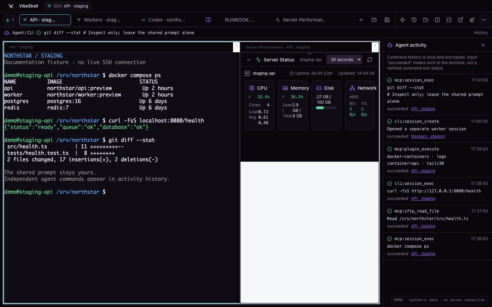
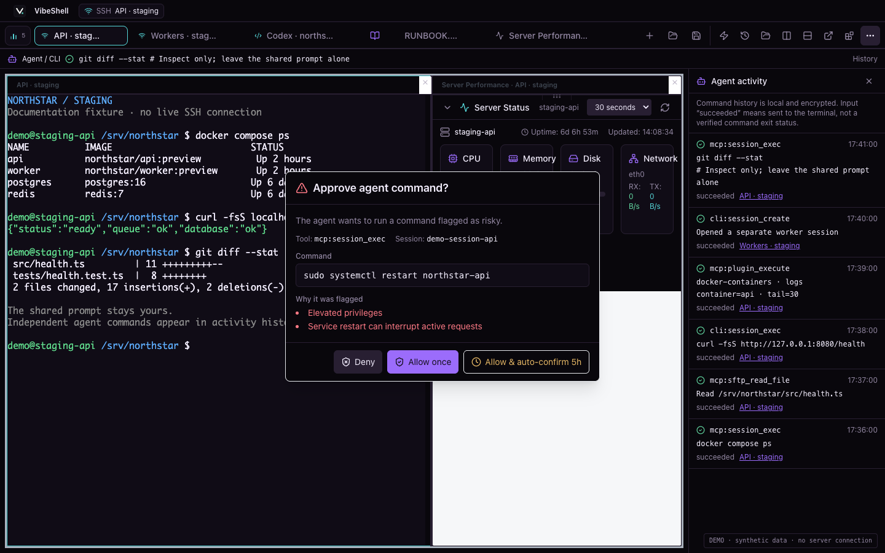
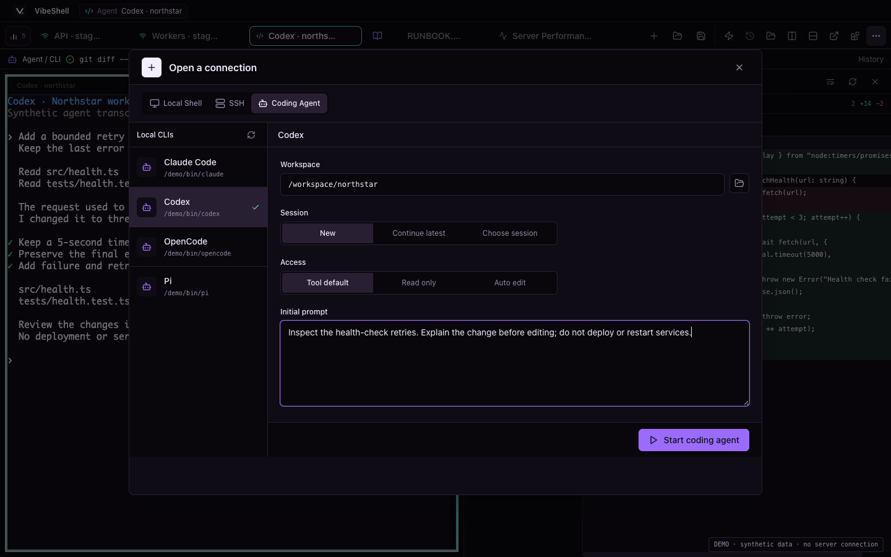
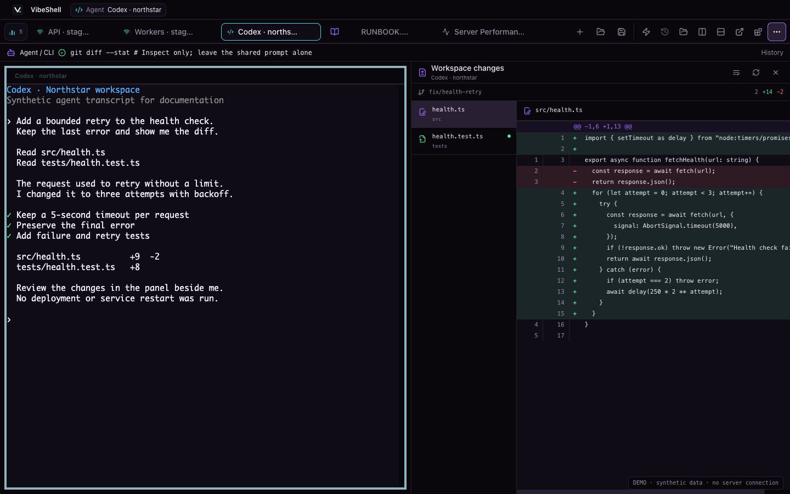
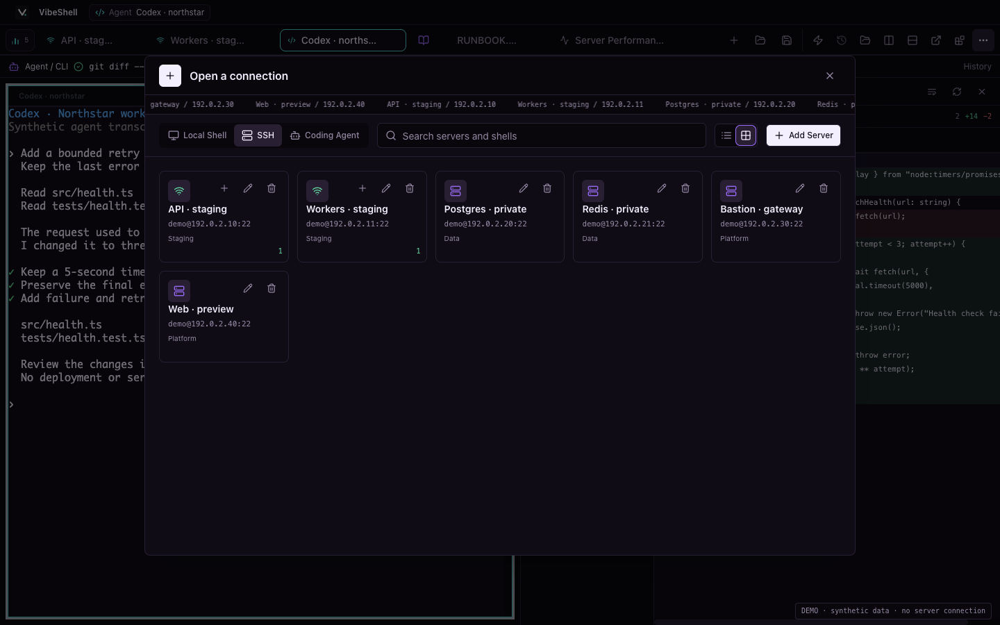

<div align="center">
  
  <h1>VibeShell</h1>
  <p><strong>Keep your servers, files, and AI work in the same place.</strong></p>
  <p>An SSH terminal you can work in yourself, share with an agent, and make your own.</p>

  [English](README.md) · [简体中文](README.zh-CN.md) · [日本語](README.ja.md)

  [](https://github.com/veithly/vibeshell/actions/workflows/ci.yml)
  [](https://github.com/veithly/vibeshell/releases)
  [](LICENSE)

  [Download](https://github.com/veithly/vibeshell/releases) · [Agent / CLI guide](skills/vibeshell/SKILL.md) · [Changelog](CHANGELOG.md) · [Contribute](CONTRIBUTING.md)
</div>



*Real VibeShell components, synthetic Northstar demo data. The gallery uses an isolated browser fixture: no live servers, credentials, model calls, or service restarts. Agent transcripts and command results are examples, not recordings of an actual agent run. [Reproduce the screenshots](scripts/readme-demo/README.md).*

## Less passing context between tools

A routine server task rarely stays in one terminal. You check a log, find a configuration file, open an editor, ask an agent for help, then work out which machine and session each tool is using.

VibeShell keeps that work together. SSH and local terminals, coding agents, remote files, Git changes, and operations dashboards share a tabbed workspace. Use it as a normal terminal; bring AI into the parts where it helps. You do not need a model account for ordinary terminal and file work.

The difference is the workflow, not a new SSH protocol. OpenSSH, tmux, editors and scripts can cover many of the same jobs. VibeShell reduces the setup, copying and window switching needed to make them work together.

## Let an agent help without losing the thread

### See what it ran, and where

Desktop, native CLI and MCP can use the same saved servers and discover existing sessions. When an agent runs a command, the activity strip and history show the command, session, time and operation state. Repeated attempts remain separate records; multiline commands are not reduced to a one-line label.

There are two ways to collaborate. Send input into a shared interactive shell when you want to work in that prompt together. Use independent execution when the agent should inspect something without typing over your work. Both have visible activity; “input sent” is kept distinct from “command completed.”

An agent-created session appears as another tab without switching away from the tab you selected. Two connections to the same server remain two sessions, not one ambiguous server-name tab. History can be paged through and recovered after reopening the UI.

### Approve the actual operation, not a vague request

The approval dialog puts the proposed command and the reasons for review in front of you. You can allow that operation or reject it instead of discovering a service restart in the transcript afterward. CLI and MCP plugin actions also retain their permission and confirmation checks.



*Demo request only. The service restart in this image was never executed. Command classification and approval are useful controls, not a sandbox or a guarantee that every risky command will be recognized.*

## Bring your coding agent, not another chat window

Launch separately installed tools such as **Claude Code, Codex, OpenCode and Pi** in real local terminals. Pick a project directory, add an initial brief, and choose the start modes the selected tool supports: a new session, continuing the latest one, or choosing a previous session. Access modes are explicit rather than hidden in a command copied from a tutorial.



The agent's terminal stays beside the rest of your work. Open **Workspace changes** to see the branch, changed files and line-by-line diff. You can read the proposed edit instead of relying on the agent's summary of it. Local development and remote operations can live in neighboring tabs, but they are not silently treated as the same execution environment.



*Agent tools need their own installation, sign-in and subscriptions. VibeShell provides the workspace and launch integration; it does not bundle a model subscription or claim the sample transcript is live output.*

## A terminal that helps with the small things

You should not need AI just to remember a flag. Built-in completion suggests commands, subcommands and options, with descriptions and command-history matches. Inline suggestions and a keyboard-driven completion list keep the answer near the cursor. Frequently used commands can become snippets, while **Quick Cmd** runs a short inspection and shows its output without taking over your interactive shell.

For an extra nudge, enable **AI command prediction** with your own OpenAI-compatible or Claude endpoint and model. It proposes a suffix to what you are typing; it does not run the suggestion for you. This is separate from launching a coding agent.

**Prediction is off by default.** When enabled, the current input, recent command history and local completion candidates are sent to the provider you configure. Leave it disabled for work that must not leave the machine; ordinary local completion remains available.

Terminal rendering uses xterm.js, a WebGL renderer where available, and batched input/output paths to reduce UI overhead. These are responsiveness choices, not a claim that VibeShell makes the SSH network faster.

## Find a connection without remembering an address

The connection launcher brings **SSH, local shells and coding agents** into one place. Search your saved servers, switch between compact lists and cards, and organize targets with groups and tags. Existing-session indicators and a separate new-session action help distinguish “return to my work” from “open another connection.”



Bring existing profiles from OpenSSH, PuTTY or Tabby, preview an import before applying it, and configure a jump host for private targets. Stored passwords from those other applications are deliberately not copied; PuTTY `.ppk` keys need conversion to OpenSSH format.

Changing a saved password, private key or passphrase does not require deleting the server. Untouched fields keep their values, existing secrets are not loaded into the edit form, and profile/credential changes save together or roll back together. This changes **VibeShell's saved login information**, not the remote account's password.

## Files belong next to the command that uses them

Open a remote configuration through SFTP, or use **⌘/Ctrl+O** for local files without opening an SSH connection at all. Documents get their own tabs, so closing the last terminal does not close your local notes.

The file workspace offers editable text/code, syntax highlighting, and Markdown source, preview, or both side by side. SFTP includes column/icon browsing, multiple selection, path copying, upload/download progress, and viewers for supported images, PDFs, media and archives. Read a runbook, inspect a log and edit a config without maintaining a separate mental map of windows.

Move file and terminal panes around, split the workspace, or detach a document into another window. Unsaved text stays with its editing buffer during layout changes. Local text saves detect changes made by another program and refuse to silently overwrite them; truncated reads are not offered as a full-file save.

Folder transfer is also about correctness: bounded chunks, downloads that wait for local writes, content comparison for same-size edits, and protection for excluded paths and nested `.gitignore` rules when deleting extras. Content comparison can add remote reads; it is not a promise of lower bandwidth.

[Local files, Markdown behavior and editing limits](docs/local-files-and-css-themes.md)

## Go from a command to a useful view

Sometimes a terminal is the right view; sometimes a container list or a CPU graph is faster to understand. Open a plugin for the session you are already using instead of configuring the same server in another dashboard.

| What you are working on | Built-in views and tools |
| --- | --- |
| A slow or unhealthy host | Server Performance, Process Explorer, System Logs, Network Inspector, Disk Usage |
| Services and infrastructure | Docker Containers, Kubernetes Pods, Cron Scheduler, Systemd Services |
| Data and code | Database Inspector, Redis Inspector, Git Workspace |

These **12 built-ins** are more than UI buttons. Agents can discover what is installed, read an action's inputs, fetch its current instructions and use it through the native CLI or MCP:

```bash
vibeshell plugins list --installed --json
vibeshell plugins describe server-performance
vibeshell plugins docs server-performance
vibeshell plugins run server-performance status --session SESSION_ID --inputs '{}'
```

Use an existing session ID and check the plugin is installed and enabled first. The main Skill contains an index; detailed usage lives in `references/<plugin-id>.md`. Supported imported declarative plugins expose the same discovery interface, with documentation generated from their current validated manifest.

Reading a plugin's documentation does not grant permissions, install remote tools or approve a destructive action. Docker, Kubernetes and database tools still need the appropriate target environment and access. Remote host-performance collection currently assumes Linux `/proc`.

[Plugin specification](docs/plugin-spec.md) · [Agent and plugin reference index](skills/vibeshell/SKILL.md#plugin-discovery-and-references)

## Arrange it around the way you work

**Keep context, not a pile of windows.** Terminals, documents and plugins can be split, rearranged and moved into separate windows. Save a layout and return to it; restoring the workspace is not a promise that an old network connection survives a process restart.

**Make long sessions comfortable.** Choose light or dark themes, follow the system appearance, adjust terminal fonts and cursors, and use keyboard navigation or reduced-motion settings. The application has English and Simplified Chinese UI; the Japanese README is a documentation translation, not a claim of Japanese UI support.

**Go beyond a color preset.** The custom CSS editor supports live preview, apply/save, import/export and local background images. Change spacing, corners and document typography as well as colors. If a theme hides the controls, **⌘/Ctrl+Shift+F12** or the native *Disable Custom CSS* menu can turn it off. Only apply trusted CSS: remote URLs in a theme can make network requests.

[Custom CSS guide and recovery](docs/local-files-and-css-themes.md) · [Starter theme](themes/vibecode-starter.css)

## The SSH essentials are still here

Local forwarding, SOCKS5 and reverse forwarding sit alongside session recording and playback. Saved tunnel configurations reduce repetitive setup; session cleanup also tears down associated tunnels and recordings. Check bind addresses before exposing a service beyond loopback.

Optional encrypted **Gist/WebDAV sync** carries server metadata, groups, snippets and plugin installations between your own setups. It is not a VibeShell-hosted SSH relay. Login credentials, host-key trust, live terminal sessions and agent activity history stay outside that sync. Protect provider tokens and recovery material, and review plugin settings before sharing an export.

SSH host identity is checked before authentication, including the real destination behind a jump host. Credentials and agent activity use encrypted local storage. That is not OS Keychain custody or protection from a compromised local account. A correct private key does not justify accepting an unexpected server fingerprint.

## Start with a server you already use

Get the desktop installer or standalone CLI from [Releases](https://github.com/veithly/vibeshell/releases).

| Platform | Desktop | Native CLI |
| --- | --- | --- |
| macOS Apple Silicon / Intel | Architecture-specific `.dmg` | `.tar.gz` |
| Windows x64 | `.exe` / `.msi` | `.zip` |
| Linux x64 | `.AppImage` / `.deb` | `.tar.gz` |

The desktop includes a CLI sidecar. Standalone CLI archives include `install.sh` / `install.ps1`; inspect the script before running it. The native Rust CLI itself does not need Node.js. [CLI installation](cli/README.md)

```bash
vibeshell import auto --dry-run    # Review, then run without --dry-run to import.
vibeshell servers
vibeshell ssh my-server
vibeshell ssh my-server -- uname -a
vibeshell sessions
vibeshell sftp my-server ls /srv/app
```

Replace `my-server` with a saved name. Use an alias returned by `sessions` with `vibeshell ssh-session ALIAS -- pwd`; add `--new` when you need a separate connection. For complex quoting, use `--command-file` or `--command-stdin`. Never put passwords or private keys in command-line arguments or agent prompts.

The CLI can start a daemon when needed; the GUI can attach to its sessions. The process owning a connection must remain alive: daemon-owned sessions can outlive the GUI, while GUI-owned ones end when that GUI exits. Upgrade the desktop and CLI together, and save ongoing work before restarting.

Apple signing/notarization details are in each release's notes. An ad-hoc signature is not Apple notarization. Mobile targets remain experimental. Common OpenSSH paths are tested, but not every MFA flow, hardware token or SSH implementation. Proposed CLI server-create/delete and Teleport support are not part of the current 1.1.0 release.

## Build, contribute, or explore the implementation

Built with Tauri 2, Rust, React, TypeScript and xterm.js. Use Node.js 22.12+, current stable Rust and the [Tauri platform prerequisites](https://v2.tauri.app/start/prerequisites/).

```bash
git clone --branch dev https://github.com/veithly/vibeshell.git
cd vibeshell
npm ci
npm run tauri -- dev
```

Before a PR: `node scripts/check-release.mjs`, `npm test`, `npm run build`, `cargo fmt --all -- --check`, `cargo clippy --workspace --all-targets --locked -- -D warnings`, and `cargo test --workspace --locked`. SSH changes also have a loopback-only Docker fixture: `bash scripts/test-ssh-compatibility.sh`. Never run credential tests against a real saved-server store.

**All normal PRs target `dev`.** `main` receives tested release promotions from this repository's `dev`; `master` is historical. Build commands do not authorize replacing an installed app or ending someone's SSH sessions.

[Contributing](CONTRIBUTING.md) · [Architecture](AGENTS.md) · [Release process](docs/RELEASING.md) · [Collaboration API](docs/AGENT_COLLABORATION.md)

Report security concerns through [private security reporting](https://github.com/veithly/vibeshell/security/advisories/new), not with real credentials in an issue. Approval controls are not a sandbox; protected input cannot prevent a remote program from echoing it. Do not automatically replay a mutating command after an ambiguous response loss.

## License

VibeShell 1.1.0 and later are distributed as a whole under **GPL-3.0-only**. See [LICENSE](LICENSE), [NOTICE](NOTICE) and the [preserved MIT notice](licenses/legacy-MIT.txt). Earlier MIT permissions are not revoked; third-party components keep their own licenses. Release downloads include corresponding source and notices. No warranty is provided to the extent permitted by law.
