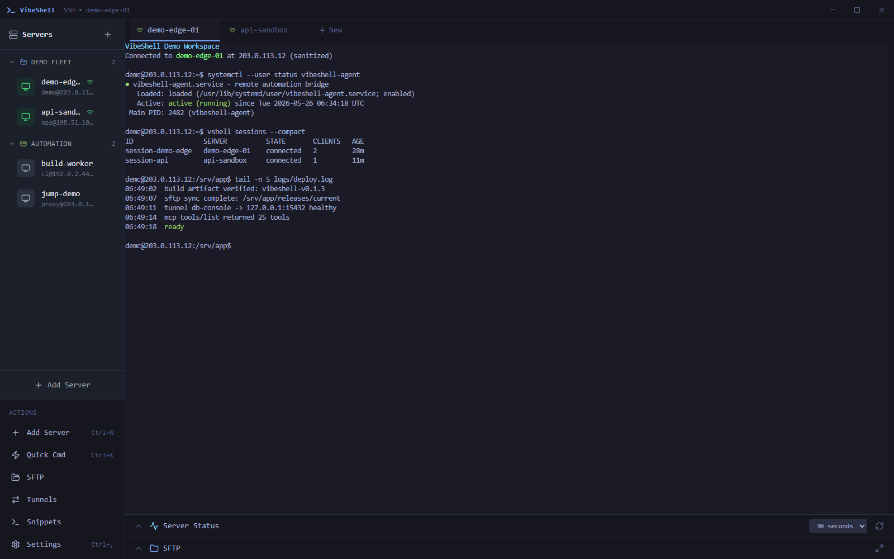
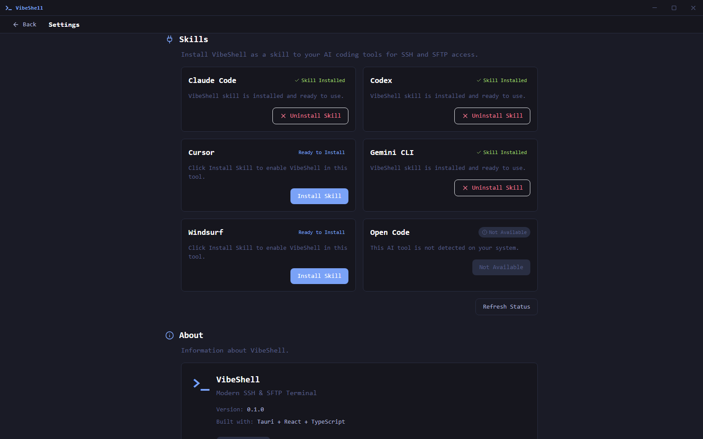
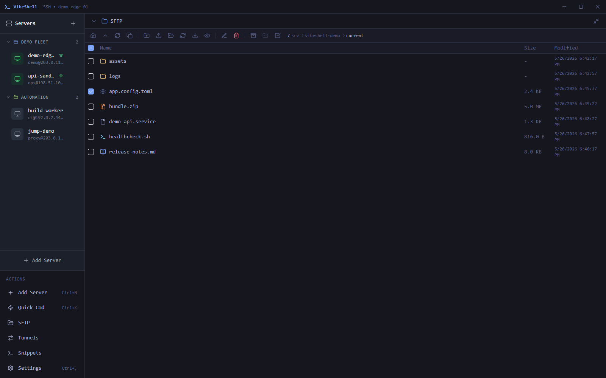
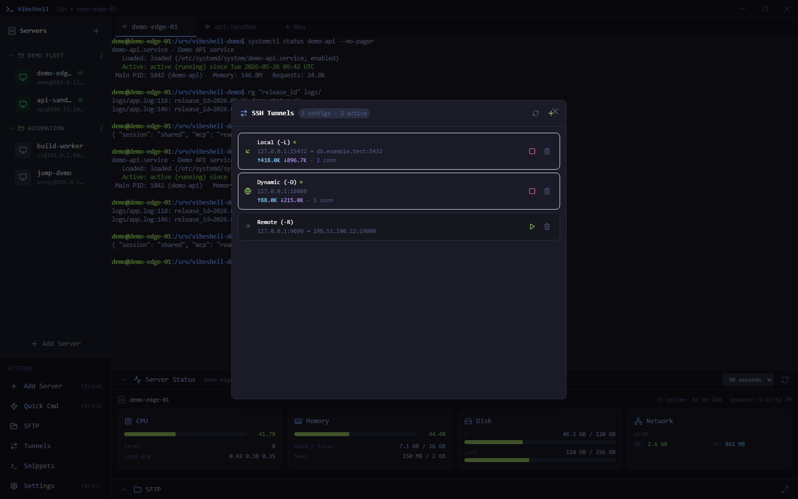

<div align="center">


# VibeShell

**An AI-native SSH, SFTP, tunnel, and local terminal workspace for developers who ship from the command line.**

[](https://github.com/veithly/vibeshell/releases)
[](https://github.com/veithly/vibeshell/actions/workflows/ci.yml)
[](https://v2.tauri.app)
[](https://react.dev)
[](https://www.rust-lang.org)
[](#install)

[Screenshots](#screenshots) · [Why It Exists](#why-it-exists) · [Features](#features) · [AI Agents](#ai-agents) · [Install](#install) · [Build](#build-from-source)

</div>



VibeShell is a modern desktop terminal for people and AI agents working on the same machines. It combines a polished SSH client, SFTP file manager, SSH tunnel control panel, local shell, session recording, and an MCP-powered AI integration layer in one native Tauri app.

If you have ever asked an AI coding agent to deploy, inspect logs, edit a remote config, or move files over SSH, VibeShell gives it a real, reusable, observable workspace instead of a pile of brittle one-off shell commands.

> The screenshots in this README use sanitized demo servers and reserved documentation addresses. No real hostnames, IPs, credentials, or customer data are shown.

## Screenshots

| Terminal + server status | AI tool integrations |
| --- | --- |
|  |  |

| SFTP workflow | SSH tunnels |
| --- | --- |
|  |  |

## Why It Exists

Traditional SSH clients assume a single human is typing everything. AI coding agents changed that: now the operator, the CLI, and the assistant all need to see enough context to act safely.

VibeShell is designed around that new workflow:

- **Human-friendly by default**: fast tabs, xterm.js rendering, command snippets, local shell, SFTP, tunnels, and session recording.
- **Agent-ready when needed**: built-in MCP tools expose server, session, command, search, and SFTP workflows to compatible AI tools.
- **Observable automation**: agents can connect, run commands, inspect output, and transfer files while you keep the UI open as the control room.
- **Native and local-first**: Rust backend, SQLite storage, encrypted credentials, and no hosted control plane.

## Features

### Terminal Workspace

- Multi-tab SSH sessions and local shell sessions.
- Smooth terminal rendering with xterm.js and WebGL support.
- Session status panel for CPU, memory, disk, load, and network metrics.
- Ghost-text completions for common terminal commands.
- Command snippets with search, tags, copy, and insert actions.
- Terminal session recording for audit, replay, and handoff.

### SSH, SFTP, And Tunnels

- Password, key, and key-with-passphrase authentication.
- Saved encrypted credentials and per-server configuration.
- Host key verification with trusted fingerprint management.
- Jump host / ProxyJump support for bastion access.
- SSH agent forwarding.
- SFTP browser with preview, upload, download, rename, delete, mkdir, recursive upload, and sync flows.
- Local forward, remote forward, and dynamic SOCKS5 tunnels.

### AI Agents

VibeShell includes an MCP server plus a skill installer for AI coding tools. The installer detects tools such as Claude Code, Codex, Cursor, Open Code, Gemini CLI, Windsurf, Roo Code, Continue, Kiro, Trae, OpenHands, and more, then installs a VibeShell skill so the agent knows how to use the workspace.

The MCP layer currently exposes 25 tools, including:

| Area | Tools |
| --- | --- |
| Server inventory | `server_list`, `server_add`, `server_get`, `server_update`, `server_delete` |
| Sessions | `session_list`, `session_create`, `session_attach`, `session_detach`, `session_kill` |
| Remote commands | `exec`, `rg` |
| SFTP | `sftp_ls`, `sftp_upload`, `sftp_upload_directory`, `sftp_sync_directory`, `sftp_download`, `sftp_mkdir`, `sftp_rm`, `sftp_mv`, `sftp_read`, `sftp_write` |
| File editing | `get_content`, `edit_file`, `add_file` |

Example intent:

```text
You: "Check the demo API logs, patch the config, upload the build, and restart the service."

Agent:
1. Finds the configured demo server.
2. Opens or reuses a VibeShell session.
3. Reads logs with exec/rg.
4. Edits the remote config through SFTP tools.
5. Uploads the new build directory.
6. Restarts the service and reports the verified result.
```

## Architecture

```text
VibeShell
├─ React 18 + TypeScript + Zustand + Tailwind
│  ├─ Server list, session tabs, terminal, SFTP, tunnels, settings
│  └─ safeInvoke wrappers for all Tauri IPC calls
├─ Tauri 2 IPC bridge
├─ Rust backend
│  ├─ russh SSH client and session manager
│  ├─ russh-sftp operations and recursive sync helpers
│  ├─ SQLite storage and encrypted credentials
│  ├─ SSH tunnel manager
│  ├─ local shell manager
│  └─ MCP HTTP + stdio transports
└─ vshell CLI
   ├─ SSH/SFTP/session commands
   └─ headless service and AI-tool installer
```

## Install

Download the latest installer from [GitHub Releases](https://github.com/veithly/vibeshell/releases).

| Platform | Desktop app | CLI sidecar |
| --- | --- | --- |
| Windows x64 | `.exe` / `.msi` | `vshell-windows-x64.exe` |
| macOS Apple Silicon | `.dmg` | `vshell-macos-arm64` |
| macOS Intel | `.dmg` | `vshell-macos-x64` |
| Linux x64 | `.deb` / `.AppImage` / `.rpm` | `vshell-linux-x64` |

The desktop installer bundles `vshell`, so terminal-native workflows and AI-tool integrations can use the same VibeShell workspace.

## Build From Source

Prerequisites:

- Node.js 18 or newer.
- Rust stable.
- Tauri platform prerequisites for your OS.
- On Windows, Visual Studio Build Tools with the C++ workload.

```bash
git clone https://github.com/veithly/vibeshell.git
cd vibeshell
npm ci
npm run build
cargo check
cargo test
```

Run in development:

```bash
npm run dev
npx tauri dev
```

Build release binaries:

```bash
# Frontend + Rust checks
npm run build
cargo check
cargo test

# Desktop app; release CI builds and copies the vshell sidecar first.
npx tauri build
```

Windows installer packaging:

```powershell
powershell -NoLogo -NoProfile -ExecutionPolicy Bypass -File scripts/build-msi.ps1 -NoPause
```

The Windows packaging script builds the `vshell` CLI in release mode, copies it to the Tauri sidecar location, and produces NSIS and MSI installers.

## CI And Release

GitHub Actions run:

- Frontend type-check and Vite build.
- Rust `cargo check` and `cargo test` on Linux, Windows, and macOS.
- Linux `cargo clippy -- -D warnings`.
- Release builds for Windows x64, macOS arm64/x64, and Linux x64.

The release workflow can be triggered from tags (`v*`) or manually with a patch/minor/major bump.

## Project Layout

```text
src/                    React frontend
src/components/         Terminal, SFTP, settings, tunnels, dialogs
src/stores/             Zustand stores for app state
src/i18n/               English and Simplified Chinese locales
src/lib/tauri.ts        safeInvoke and IPC helpers
src-tauri/              Rust/Tauri backend
src-tauri/src/ssh/      SSH client and host fingerprints
src-tauri/src/sftp/     SFTP operations and sync helpers
src-tauri/src/mcp/      MCP tools and transports
src-tauri/src/install/  AI tool detection and skill installer
cli/                    vshell CLI companion
docs/                   Design notes, plans, and README screenshots
```

## Contributing

Issues and pull requests are welcome. The best contributions are small, verified, and focused:

1. Search existing issues and code paths first.
2. Keep behavior changes narrow.
3. Add or update focused tests when behavior changes.
4. Run `npm run build`, `cargo check`, and `cargo test` before opening a PR.

If VibeShell helps your remote workflow, a star makes the project easier for other agent-powered developers to discover.
